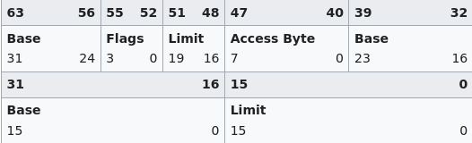
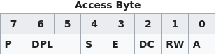
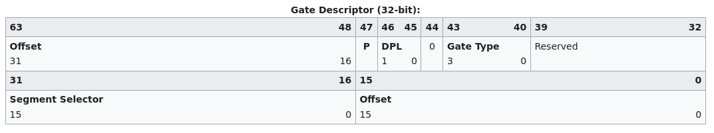
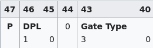

# Booting process
The **bootloader** boots up the **kernel** by calling the external *kernel_main* function from the *kernel.c* file. The identification of this bootloader is by it's unique bootloader sign, which will define it as a bootloader for **GRUB** and that is, **0x1BADB002**.

# Memory and VGA
The memory while developing an OS, is *RAM* **( Random Access Memory)**. The address **0xB8000** is the address to the VGA video memory. We can write to this block of memory directly by creating a **char*** to that address. This memory block has two parts, for text and colour. **They can be accessed using +1 the counter in the loop while printing.**

# The Global Descriptor Table or GDT
The **GDT** is used to seperate each **memory segments** to later differenciate in them. There are 6 entries intotal in a GDT. They are as follows:
- ### Null Segment (For backup)
- ### Kernel Code Segment (For code)
    - It can be executed
    - It can be read
    - Only kernel can access it
    - It is not writable
    - It grows in upward direction
- ### Kernel Data Segment (For data)
    - It can be read
    - It cannot be executed
    - Only kernel can access it
    - It is not writable
    - It grows in upward direction
- ### User Code Segment (For code of user apps)
    - It can read
    - It can be executed
    - It has the lowest privilage and user can access it
    - It is not writable
    - It grows upward in direction
- ### User Data Segment (For data of user apps)
    - It can be read
    - It cannot be executed
    - It has the lowest privilage and user can access it
    - It is not writable
    - It grows upward in memory
- Task State Segment (For multi-tasking and switching PID's)

# Structure and Access Bytes in GDT
The **structure** of **GDT** is bit unique. The following image represents the structure of a GDT:

 

In this structure, there are the following things:
- ### Limit
    - This is the address till where the segment can extend. This field is of 16 bits and the next limit block is ignored and merged into it and in place of that, we place the flags field.
- ### Base (Low)
    - This is the low 16 bits of the address.
- ### Base (Middle)
    - This is the middle 8 bits of the address.
- ### Access Bytes
    - These are the 8 bits of the entry which defines the type, access, direction of growth and other useful things for the entry.
- ### Flags
    - As I told earlier, we skip the limit after access bytes. These flags are for some other useful things which access bytes don't define. One of them is merging the base addresses spread in the entry.
- ### Base (High)
    - These are the high 8 bits of the address.In total, the base is of 32 bits.

## Access Bytes
Now, we have a specific section to talk about ***access bytes*** as they are the most complex field in the GDT. The following is the structure of a access bit that itself defines the important fields such as, type, access, direction of growth etc.

The following fields are present in it:
- ### P (Present)
    - This tells if the segment is present or not. It must be set to (1) if it is a valid segment. The null segment is just for spacing and backup, hence it doesn't has it.
- ### DPL (Privilage Level)
    - It tells the privilage level of the segment. If it is (0), it has the highest privilage or the kernel privilage. If it is (3) or in binary, (11), it has the lowest privilage or the user privilage.
- ### S (Segment Type)
    - It tells the type of the segment. If it is (0), it has to be a system segment (like Task State Segment). If it is (1), it has to be a code or data segment.
- ### E (Executable Bit)
    - It tells wheater the segment is executable or not. If it is (0), the segment cannot be executed and if it is (1), it can be executed.
- ### DC (Direction Bit)
    - It tells in which direction will the segment grow. If it is set to (0), it grows upwards and if set to (1), it grows downwards in the stack.
- ### RW (Read/Write)
    - It tells if the segment is readable or not. If it is (1), it readable else if it is (0), it is not readable.
- ### A (Accessed Bit)
    - It tells if the segment has been accessed. By default, it should be (0), means it is not accessed. It is accessed, it will be automatically set to (1) by the PiC and CPU.

# Task State Segment (TSS)
The ***Task State Segment*** or *TSS* is used to switch context. It is accessible by the user. Context switching means to switch from one task to another. It saves the state of the current task. If whe close the OS, the task is restored to its normal state using the *TSS*.

# Interrupt Descriptor Table (IDT)
An **interrupt** is a signal to the OS to stop the current work and focus on that particular interrupt. They can occur from varoius reasons such as divison by zero, Unimplemented GDT with IDT, key press etc. There are 256 different interrupts. They are broadly classified in three categories:

- ### OS Reserved (0-31)
    - These interrupts are only for the OS and only the kernel has the permission to solve them. This includes errors like division by zero in the kernel code.

- ### Hardware (32-47)
    - These interrupts are generated from hardware and again, only kernel can handle it. This includes like key press.
- ### Software (Hardware-255)
    - These interrupts are generated from the software in the OS like from the instruction INT. It also overlaps with **Hadware Interrupts** as they can be handled by the user too by the INT instruction as ou know.

# The structure of IDT
It is a lot like GDT. But, in place of base spread all in the memory, we use the segment hex code directly. Here is a representation:

Just there are few interesting fields:
- ### Gate Type
    - It tells us wheater it is a trap, interrupt or task gate. 32-bits or 64-bits and other useful info. We have a dedicated section after this.
- ### Offset
    - The offset is the offset (means the approx) location of the handler.

# Flags in IDT
***Flags*** is a field in the *IDT* that tells the type, bits etc information for the IDT Gate. This field is this part of the IDT:

It has the following fields:
- ### Present (P)
    - It defines if a IDT gate is valid or not. Same as the GDT, it must be set to (1) for a gate to be valid
- ### DPL (Privilage Level)
    - It defines the privilage level of the IDT gate. Means, which ring can call it. Kernel or user?
- ### 0
    - It is always set to 0
- ### Gate Type
    - This defines which type of IDT gate is it. It contains the following types:
        - #### Task Gate
            - It is a task gate. Means, it gets executed for a task. It doesn't require a offset and so to use it, the offset must be 0. It hex code is 0x5
        - #### Trap Gate
            - It means that once the interrupt occurs, the kernel is trapped and forced to panic. Windows' Blue Screen of Death is a good example for this type of gate. The hex codes are as follows:
                - ##### For 16 bits
                    - 0x7
                - ##### For 32 bits
                    - 0xF
        - #### Interrupt Gate
            - It tells that once the interrupt occurs, handle it and then come back from where the kernel left. A key press or an assembly INT instruction are some daily examples for this. The hex codes are as follows:
                - ##### For 16 bits
                    - 0x6
                - ##### For 32 bits
                    - 0xE

# The Programmable Interrupt Controller (PiC)
The ***Programmable Interrupt Controller*** also popularly called ***PiC*** (pronounced **Pi-K**) is responsible for receiving and handling interrupts. It is essential to set up PiC before loading the IDT. There are some codes to set up the PiC. We will come back to it later. There are two PiC's, the Master PiC and the Slave PiC. The Master PiC has two ports and so the Slave PiC. They are as follows:

- ### For Master PiC
    - #### Command Port
        - 0x20
    - #### Data Port
        - 0x21
- ### For Slave PiC
    - #### Command Port
        - 0xA0
    - #### Data Port 
        - 0xA1

# The PiC Codes
The PiC Codes are:
- ### For Initialising PiC
    - First of all, to initialize the PiC, we cand use the code **0x11** which is **0x10 | 0x01**. Here, the 0x10 is the init code and 0x01 is the offset.
- ### For Mask/Unmask
    - Now, it gets complicated. Whenever we have to use some interrupts, we have to unmask them by sending the respective codes to both the PiC's data port. They are as follows if we want to unmask all the IRQS:
        - #### For Master PiC
            - ##### 0x20
                - It means unmask all IRQS present on the Master PiC
        - #### For Slave PiC
            - ##### 0x28
                - It means unmask all IRQs present on the Slave PiC
- ### For Custom Means
    - There are various more codes that all cannot be remembered. However, they can be found in the code.

# The ATA Interface
The ***Advanced Technology Attachment*** (ATA) interface, also known as ***IDE*** or ***PATA***, is a standard interface for connecting storage devices like hard drives. The ATA interface uses I/O ports for communication and has several important registers and status bits:

# ATA Port Map
| Port | Primary Channel (Master/Slave) | Secondary Channel (Master/Slave) | Description |
|------|-------------------------------|----------------------------------|-------------|
| **COMMAND PORTS** |
| 0x1F0/0x170 | ✓ | ✓ | Data Port (R/W) |
| 0x1F1/0x171 | ✓ | ✓ | Error (R) / Features (W) |
| 0x1F2/0x172 | ✓ | ✓ | Sector Count |
| 0x1F3/0x173 | ✓ | ✓ | LBA Low/Sector Number |
| 0x1F4/0x174 | ✓ | ✓ | LBA Mid/Cylinder Low |
| 0x1F5/0x175 | ✓ | ✓ | LBA High/Cylinder High |
| 0x1F6/0x176 | ✓ | ✓ | Drive/Head Select |
| 0x1F7/0x177 | ✓ | ✓ | Status (R) / Command (W) |
| **CONTROL PORTS** |
| 0x3F6/0x376 | ✓ | ✓ | Alternate Status/Device Control |
| 0x3F7/0x377 | ✓ | ✓ | Drive Address |

# Status Register Bits (0x1F7/0x177)
| Bit | Name | Description |
|-----|------|-------------|
| 7 | BSY | Busy - Drive is processing a command |
| 6 | DRDY | Drive Ready - Ready to accept commands |
| 5 | DWF | Drive Write Fault |
| 4 | DSC | Drive Seek Complete |
| 3 | DRQ | Data Request - Ready for data transfer |
| 2 | CORR | Corrected Data - Data was corrected |
| 1 | IDX | Index - Set once per disk revolution |
| 0 | ERR | Error occurred |

# Error Register Bits (0x1F1/0x171)
| Bit | Name | Description |
|-----|------|-------------|
| 7 | BBK | Bad Block |
| 6 | UNC | Uncorrectable Data Error |
| 5 | MC | Media Changed |
| 4 | IDNF | ID Not Found |
| 3 | MCR | Media Change Request |
| 2 | ABRT | Command Aborted |
| 1 | TK0NF | Track 0 Not Found |
| 0 | AMNF | Address Mark Not Found |

# Common ATA Commands
| Command | Code | Description |
|---------|------|-------------|
| IDENTIFY | 0xEC | Get drive information |
| READ_SECTORS | 0x20 | Read sectors using LBA |
| WRITE_SECTORS | 0x30 | Write sectors using LBA |
| CACHE_FLUSH | 0xE7 | Flush drive cache |
| EXECUTE_DRIVE_DIAGNOSTIC | 0x90 | Perform drive diagnostic |
| INITIALIZE_DRIVE_PARAMETERS | 0x91 | Initialize drive parameters |
| STANDBY_IMMEDIATE | 0xE0 | Put drive in standby mode |
| IDLE_IMMEDIATE | 0xE1 | Put drive in idle mode |
| SLEEP | 0xE6 | Put drive in sleep mode |

The ATA interface requires careful timing and status checking. When sending commands:

1. Wait for BSY and DRQ to clear
2. Send command and parameters
3. Wait for BSY to clear and DRQ to set before transferring data
4. Check status register for errors after command completion

Proper error handling and timeouts are essential for reliable ATA operations. The interface supports both PIO (Programmed I/O) and DMA (Direct Memory Access) modes, though PIO is simpler to implement initially.

# Boot Splash Screen Implementation

The boot splash screen is implemented in splash_screen.h and displays a simple text-based welcome message when the system starts up. The process works as follows:

1. The splash screen uses the VGA text mode buffer:
   - Text mode video memory starts at 0xB8000
   - Each character takes 2 bytes:
     - First byte: ASCII character
     - Second byte: Color attributes (foreground and background)

2. Text formatting:
   - Characters are written directly to video memory
   - Color attributes can be set for each character
   - Screen can be cleared by writing spaces with desired background color
   - Cursor position can be controlled for text placement

3. Display process:
   - Clear the screen first
   - Position text in the center of the screen
   - Write welcome message with chosen colors
   - May include ASCII art or borders for decoration

The splash screen provides immediate visual feedback that the system is booting successfully. It uses basic VGA text mode operations rather than graphics mode, making it simple and reliable during early boot stages.

# Timer Implementation in IDT

## What is a Timer?
A timer, specifically the Programmable Interval Timer (PIT), is like a metronome for the computer - it generates regular "ticks" at precise intervals. Think of it as an alarm clock that goes off repeatedly at very short intervals (typically milliseconds). This is crucial because:

1. Computers need precise timing to:
   - Keep track of the current time
   - Schedule tasks fairly
   - Measure how long operations take
   - Control hardware that needs regular updates

2. The PIT chip (8253/8254):
   - Has three channels (counters)
   - Channel 0 is typically used for system timer
   - Can be programmed to different frequencies
   - Generates IRQ0 when counter reaches zero

3. Physical Operation:
   - Starts with a base crystal frequency of 1.193182 MHz
   - Counts down from a programmed value
   - When it reaches zero, triggers an interrupt
   - Automatically reloads and starts again

## My Timer Implementation

The timer is implemented as an interrupt handler in the IDT. The implementation in timer.h handles IRQ0, which is mapped to interrupt 32 in the IDT. Here's how it works:

1. Timer Configuration:
   - The PIT runs at a base frequency of 1.193182 MHz
   - We configure divisor value to control interrupt frequency
   - Timer is initialized by:
     - Writing command byte to port 0x43 (PIT command register)
     - Writing divisor value to port 0x40 (Channel 0)
     - Lower byte sent first, then higher byte

2. Timer Handler Registration:
   - Timer interrupt handler is registered at IDT entry 32
   - Uses interrupt gate type (0xE) for 32-bit handler
   - Sets appropriate privilege level and present bit
   - Handler is called automatically by CPU when timer fires

3. Handler Operation:
   - Increments a tick counter each time it's called
   - Can calculate elapsed time based on tick count
   - May trigger scheduler for task switching
   - Must send EOI (End of Interrupt) to PIC when done

The timer provides several essential functions:
- **Task Scheduling**: Allows the OS to switch between tasks at regular intervals
- **Time Keeping**: Maintains system time and provides delay functions
- **System Uptime**: Tracks how long the system has been running
- **Timeout Management**: Enables implementation of timeouts for various operations

The interrupt-driven approach means the CPU can work on other tasks and only handles the timer when necessary, making it efficient and accurate. Without a timer, the OS would have no way to maintain time, schedule tasks, or handle time-dependent operations reliably.

# Keyboard Implementation

The keyboard is implemented using interrupt handling through the IDT, similar to the timer. Here's how the keyboard system works:

## Current Implementation (keyboard.h)

1. Interrupt Handler Setup:
   - Keyboard uses IRQ1, mapped to interrupt 33 in IDT
   - Handler registered using interrupt gate (0xE)
   - Handles scan codes from PS/2 keyboard controller

2. Keymap System (keymaps.h):
   - Defines mapping between scan codes and ASCII characters
   - Supports multiple keyboard layouts
   - Special handling for modifier keys (Shift, Ctrl, Alt)

3. Key Processing:
   - Reads scan code from port 0x60
   - Translates scan code to ASCII using current keymap
   - Handles modifier keys to determine final character
   - Supports key combinations and special keys

4. Features:
   - Full support for standard keyboard layouts
   - Modifier key tracking
   - Buffer system for key events
   - Clean separation between hardware and logical layers

## Deprecated Implementation (DEPRECATED/keyboard.h)

The older implementation had several limitations:

1. Basic Structure:
   - Used simpler direct port reading
   - Limited scan code translation
   - No support for multiple keyboard layouts
   - Hardcoded ASCII mappings

2. Limitations:
   - No proper modifier key handling
   - Missing support for extended scan codes
   - No key release detection
   - Limited to basic ASCII characters

3. Issues:
   - Less reliable key detection
   - No support for international keyboards
   - Poor separation of concerns
   - Harder to maintain and extend

The current implementation provides a more robust and flexible keyboard system compared to the deprecated version. It properly handles keyboard interrupts, supports multiple layouts, and provides better abstraction between hardware and software layers.